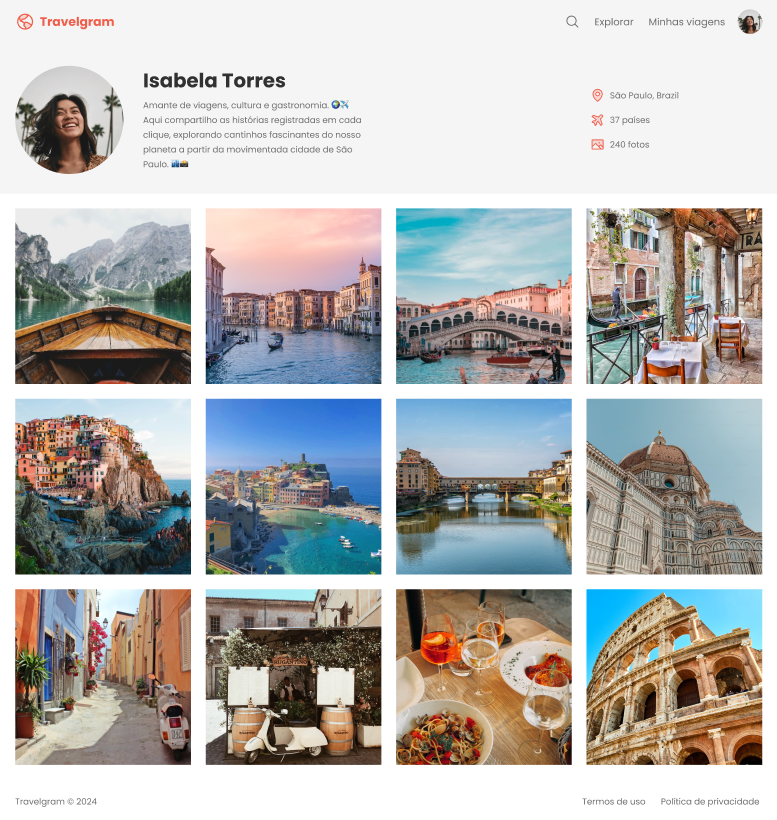

# Travelgram

> Página web desenvolvida para um design receptivo e responsivo de um perfil de uma rede social focada em viagens.

O foco do projeto é desenvolver um design responsivo utilizando afunilamento de arquivos focando na propriedade ```flex``` para todos os dispositivos terem a oportunidade de acessar a página combinado com o HTML semântico, e desenvolver uma rede social interessante para futuros usuários que gostam de viajar.


<p align="center">

</p>

## Meta

Gabriel C. Martins – gacmartins@gmail.com

[Meu perfil do Github](https://github.com/Gabriel-Dev-C/)

## Contributing

1. Fork it (<https://github.com/Gabriel-Dev-C/Travelgram/fork>)
2. Create your feature branch (`git checkout -b feature/fooBar`)
3. Commit your changes (`git commit -am 'Add some fooBar'`)
4. Push to the branch (`git push origin feature/fooBar`)
5. Create a new _Pull Request_.
